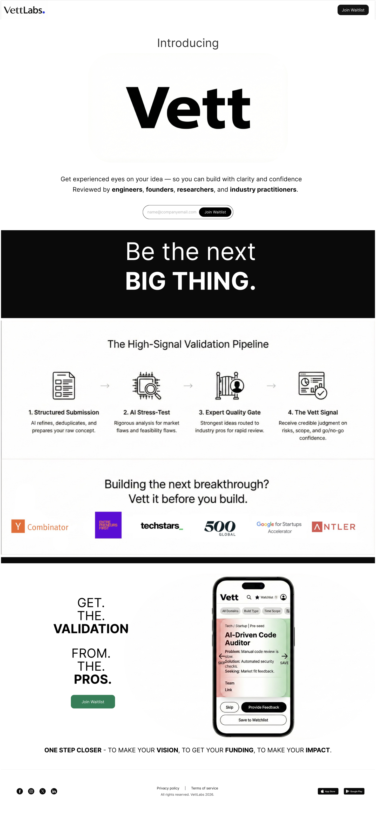

# VettLabs 🚀

**VettLabs** is a premium landing page designed for a startup validation platform. It helps founders, engineers, and researchers get expert eyes on their ideas before building, ensuring clarity, confidence, and high-signal validation.



## ✨ Features

- **Dynamic Hero Section**: A bold, high-impact introduction with a seamless waitlist integration.
- **High-Signal Validation Pipeline**: A visual representation of the vetting process.
- **Infinite Logo Carousel**: Showcases industry partnerships (Y Combinator, Techstars, etc.) with a smooth, continuous animation.
- **Premium Design System**: Built with a sleek dark/light aesthetic, using modern typography (Inter) and custom CSS variables.
- **Interactive Notifications**: Custom-built toast notification system for form feedback.
- **Fully Responsive**: Optimized for all devices, from large desktop screens to mobile phones.
- **Smooth Animations**: Includes scroll-triggered transitions, floating mockup effects, and magnetic-style hovers.

## 🛠️ Tech Stack

- **HTML5**: Semantic structure for SEO and accessibility.
- **Vanilla CSS3**: Custom design system using CSS Variables (Custom Properties), Flexbox, and CSS Grid.
- **Vanilla JavaScript**: Lightweight interactivity, scroll animations, and form handling (no heavy libraries required).
- **Intersection Observer API**: For high-performance scroll-linked animations.

## 🚀 Quick Start

To run the project locally, you can use any static file server. For example:

### Using Python
```bash
python3 -m http.server 8000
```
Then visit `http://localhost:8000` in your browser.

### Using Node.js (serve)
```bash
npx serve .
```

## 📁 Project Structure

```text
vettLabs/
├── index.html          # Main entry point
├── styles.css          # Core design system and styles
├── script.js           # Interactivity and animations
├── logos/              # Partner and brand logos
├── design_preview.png  # Project preview image
├── pipeline.png        # Validation process visual
└── ... assets          # Other generated images and PDFs
```

## 🎨 Design Tokens

The project uses a structured design system defined in `styles.css`:

- **Primary Colors**: Black (`#000000`) and White (`#FFFFFF`) for a high-contrast, professional look.
- **Typography**: `Inter` font family for maximum readability.
- **Spacing**: Modular scale ranging from `xs` to `xl`.
- **Transitions**: Predefined `fast`, `base`, and `slow` speeds for consistent UI feel.

---

Built with ❤️
